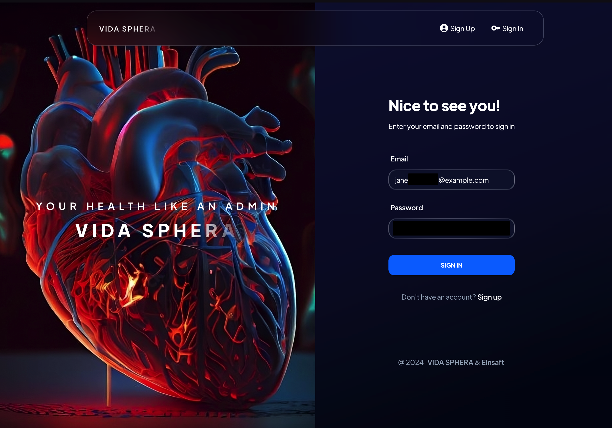
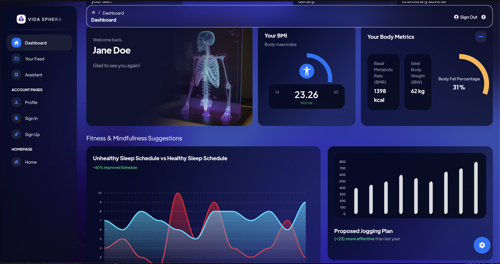
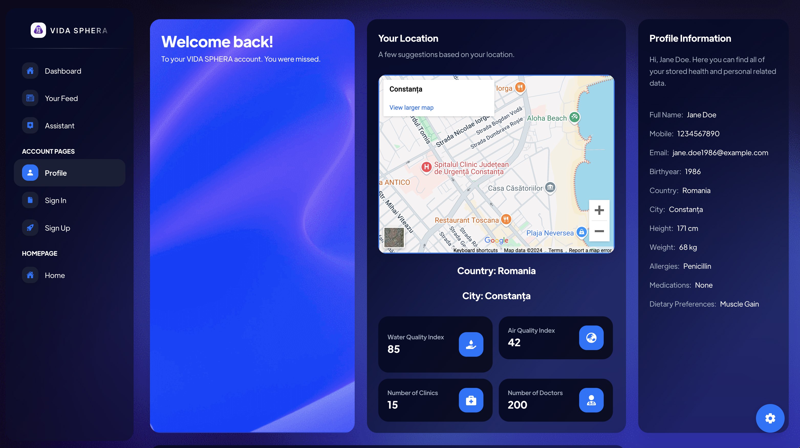
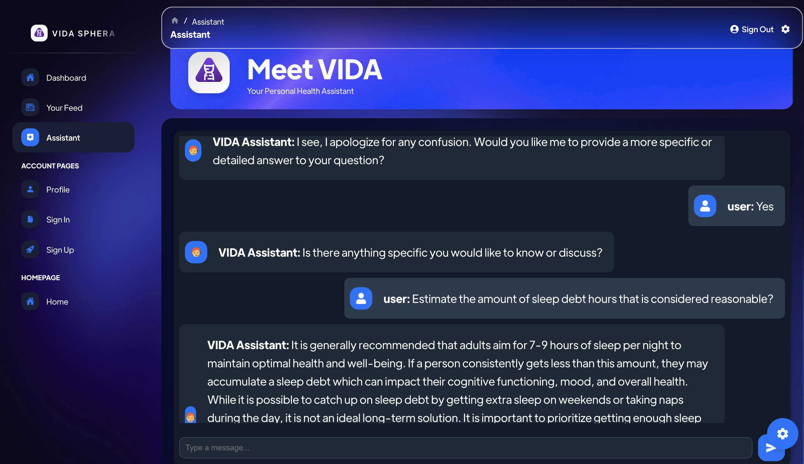

<p align="center">
  
</p>

# Vida Sphera
<p align="center">
  <a href="https://skillicons.dev">
    
  </a>
</p>

---

## 🌟 **Introduction**

**Vida Sphera** is a web application designed to provide users with personalized health-related information based on their geographic location. The app retrieves users' IP addresses to determine their locations and provides insights on air and water quality, as well as information about healthcare professionals nearby.

---

## 🚀 **Features**

- **Location Detection**: Automatically detects the user's location using their IP address.
- **Health Insights**: Provides real-time data about air and water quality in the user's area.
- **Doctor Recommendations**: Lists available healthcare professionals based on the user's location.
- **Interactive Maps**: Displays the user's location and nearby medical facilities on Google Maps.

---
## Screenshots

Here are some screenshots of the application:


*Authentication Screen*


*Health Stats Dashboard*


*Personalised News Feed*


*Health Stats Dashboard*


*Profile & Environmental Data*


*Available Doctors*


*VIDA AI Health Assistant*


---

## 🛠️ **Setup & Installation**

To run this project locally, follow these steps:

### **Prerequisites**
Ensure you have the following tools installed:
- **Node.js** (v14 or higher)
- **npm** (v6 or higher)

### **Installation Steps**

1. Clone the repository:
   ```bash
   git clone https://github.com/tudordb12/Vida_Sphera.git
   cd Vida_Sphera
   ```

2. Install dependencies:
   ```bash
   npm install
   ```

3. Create a `.env` file for environment variables:
   ```
   REACT_APP_OPENAI_API_KEY=your_openai_api_key
   ```

4. Run the application locally:
   ```bash
   npm start
   ```

The app will be available at `http://localhost:3000`.

---

## 🌐 **API Integration**

Vida Sphera makes use of several external APIs:

- **ipify API**: Retrieves the user's IP address to provide location-based information.
- **ip-api API**: Uses the IP address to fetch geolocation details such as city and country.
- **Google Maps**: Embedded Google Maps API for displaying the user's location and nearby healthcare professionals.
- **OpenAI API**: Fetches data using GPT models to provide insights into air and water quality.

---

## 🧩 **Project Structure**

```
├── public
│   ├── index.html           # Main HTML file
│   └── ...
├── src
│   ├── components           # Reusable UI components
│   ├── assets               # Static files like images, fonts, etc.
│   ├── App.js               # Main App component
│   ├── index.js             # Entry point
│   ├── services             # API services and utility functions
│   └── ...
├── .env                     # Environment variables
├── package.json             # Project metadata and dependencies
└── README.md                # Project documentation
```

---

## 🤝 **Contributing**

Contributions are welcome! If you'd like to contribute to **Vida Sphera**, please follow these steps:

1. Fork the repository.
2. Create a new branch (`git checkout -b feature/YourFeature`).
3. Make your changes.
4. Commit your changes (`git commit -m 'Add some feature'`).
5. Push to the branch (`git push origin feature/YourFeature`).
6. Open a Pull Request.

---

## 📄 **License**

This project is licensed under the MIT License. See the [LICENSE](LICENSE) file for details.

---

## 📞 **Contact**

For inquiries, please reach out to the project maintainer:

- **Name**: Your Name
- **Email**: your.email@example.com

---

Thank you for checking out **Vida Sphera**! We hope you find it useful for your health insights and recommendations.
