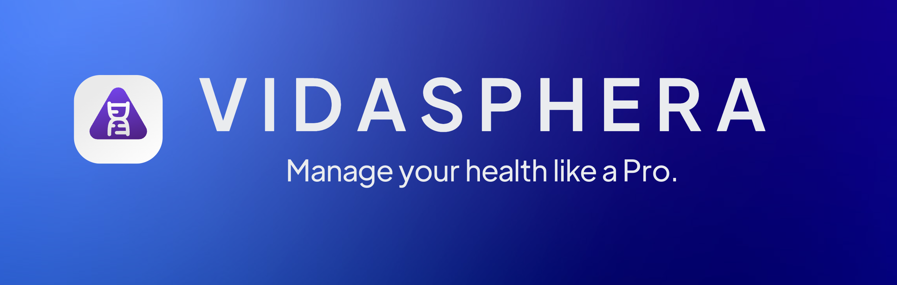
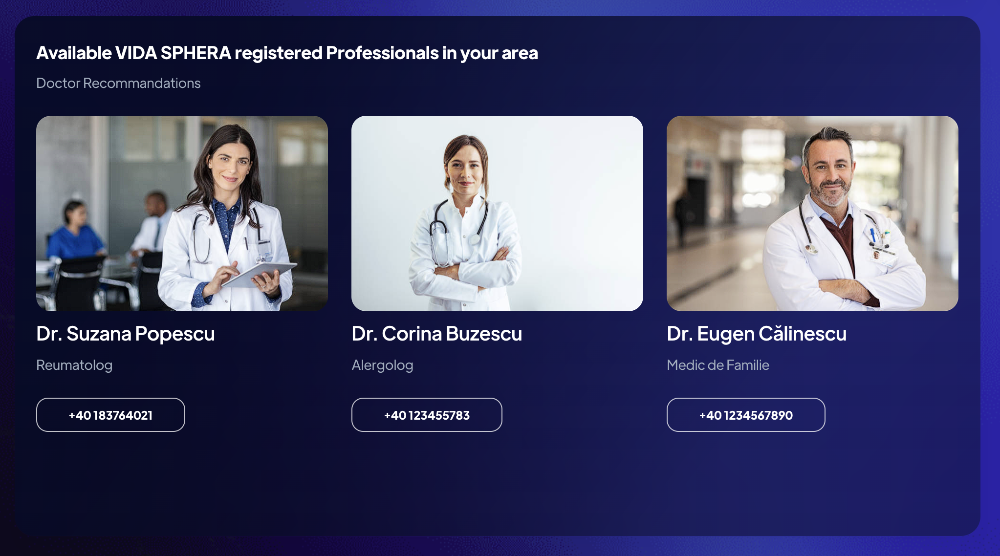

<p align="left">
  
</p>

# VIDA SPHERA

## 💻 **Developed With**

<p align="center">
  <a href="https://skillicons.dev">
    
  </a>
</p>

---

<p align="left">
  <a href="https://vida-sphera.netlify.app/">Visit the Live Web App</a>
</p>

---

## 🌟 **Introduction**

**Vida Sphera** empowers you with its unique admin-like dashboard, designed to put you in control of your
wellness journey. With personalized, AI-powered support at your fingertips—no subscriptions or barriers
—this platform ensures that you are the pro managing your health. Access insights and assistance
whenever you need, allowing you to navigate your path to better health confidently. Its intuitive design
and simplicity guarantee you receive top-notch support for your well-being—all at no cost.

After a secure sign-in, users can access a smart virtual assistant, which offers personalized guidance on tasks, lifestyle, and health. You’ll also find a customized newsfeed and access to relevant environmental information (air and water quality) as well as local healthcare providers. Looking ahead, Vida Sphera plans to offer deeper personalization, global multilingual support, and integration with health devices, making AI-driven wellness accessible to users worldwide.

---

## 🚀 **Features**

- **Location Detection**: Automatically detects the user's location using their IP address to provide local insights.
- **Health Insights**: Offers real-time data on local air and water quality.
- **AI Health Assistant**: Provides personalized suggestions and diagnoses based on user data such as age, weight, and health history.
- **Doctor Recommendations**: Displays nearby healthcare professionals and medical facilities.
- **Personalized Newsfeed**: Delivers curated health content based on user interests.
- **Health Metrics Dashboard**: Provides health stats like BMI, ideal body weight, and wellness plans.
- **Interactive Maps**: Displays nearby medical facilities on Google Maps.


---
## Screenshots

Here are some screenshots of the application:


*Authentication Screen*


*Health Stats Dashboard*


*Personalised News Feed*


*Profile & Environmental Data*


*Available Doctors*


*VIDA AI Health Assistant*


---

## Browser Support

At present, we officially aim to support the last two versions of the following browsers:

    

---
## 🛠️ **Setup & Installation**

To run this project locally, follow these steps:

### **Prerequisites**
Ensure you have the following tools installed:
- **Node.js** (v14 or higher)
- **npm** (v6 or higher)

### **Installation Steps**

1. Clone the repository:
   ```bash
   git clone https://github.com/tudordb12/Vida_Sphera.git
   cd Vida_Sphera
   ```

2. Install dependencies:
   ```bash
   npm install
   ```

3. Create a `.env` file for environment variables:
   ```
   REACT_APP_OPENAI_API_KEY=your_openai_api_key
   ```

4. Run the application locally:
   ```bash
   npm start
   ```

The app will be available at `http://localhost:3000`.

---

## 🌐 **API Integration**

Vida Sphera makes use of several external APIs:

- **ipify API**: Retrieves the user's IP address to provide location-based information.
- **ip-api API**: Uses the IP address to fetch geolocation details such as city and country.
- **Google Maps**: Embedded Google Maps API for displaying the user's location and nearby healthcare professionals.
- **OpenAI API**: Fetches data using GPT models to provide insights into air and water quality.

---

## 🧩 **Project Structure**

```
├── public
│   ├── index.html           # Main HTML file
│   └── ...
├── src
│   ├── components           # Reusable UI components
│   ├── assets               # Static files like images, fonts, etc.
│   ├── App.js               # Main App component
│   ├── index.js             # Entry point
│   ├── layouts              # The structures of the Pages.
│   └── ...
├── .env                     # Environment variables
├── package.json             # Project metadata and dependencies
└── README.md                # Project documentation
```

---

## 🤝 **Contributing**

Contributions are welcome! If you'd like to contribute to **Vida Sphera**, please follow these steps:

1. Fork the repository.
2. Create a new branch (`git checkout -b feature/YourFeature`).
3. Make your changes.
4. Commit your changes (`git commit -m 'Add some feature'`).
5. Push to the branch (`git push origin feature/YourFeature`).
6. Open a Pull Request.

---

## 📄 **License**

This project is licensed under the MIT License. See the [LICENSE](LICENSE) file for details.

---


Thank you for checking out **Vida Sphera**! We hope you find it useful for your health insights and recommendations.
